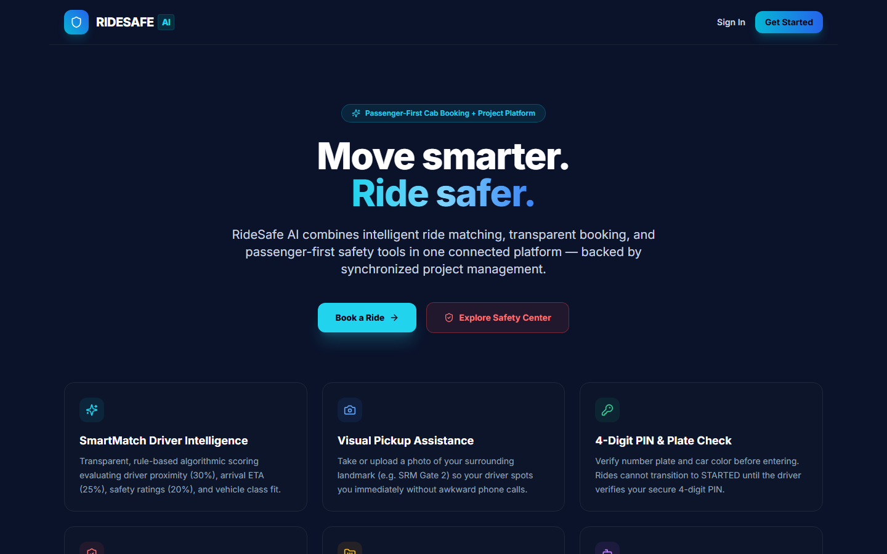
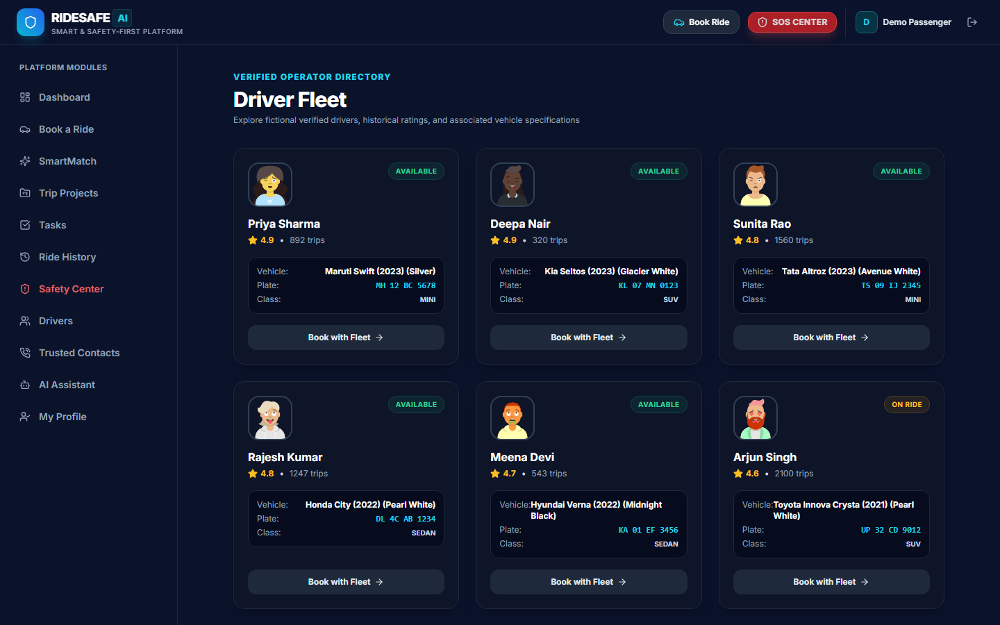
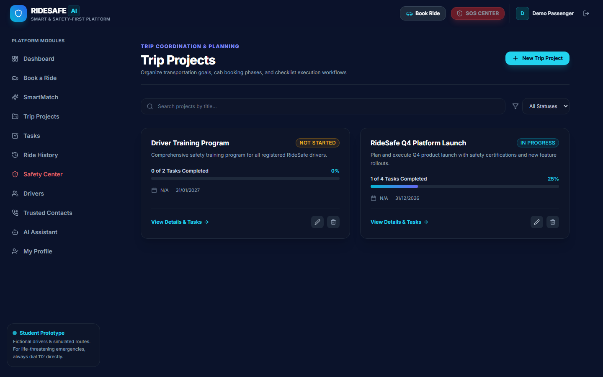
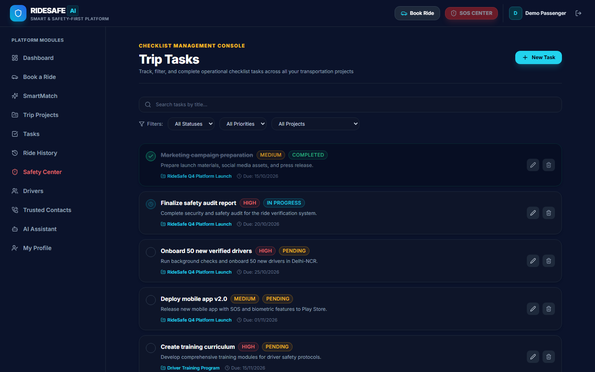
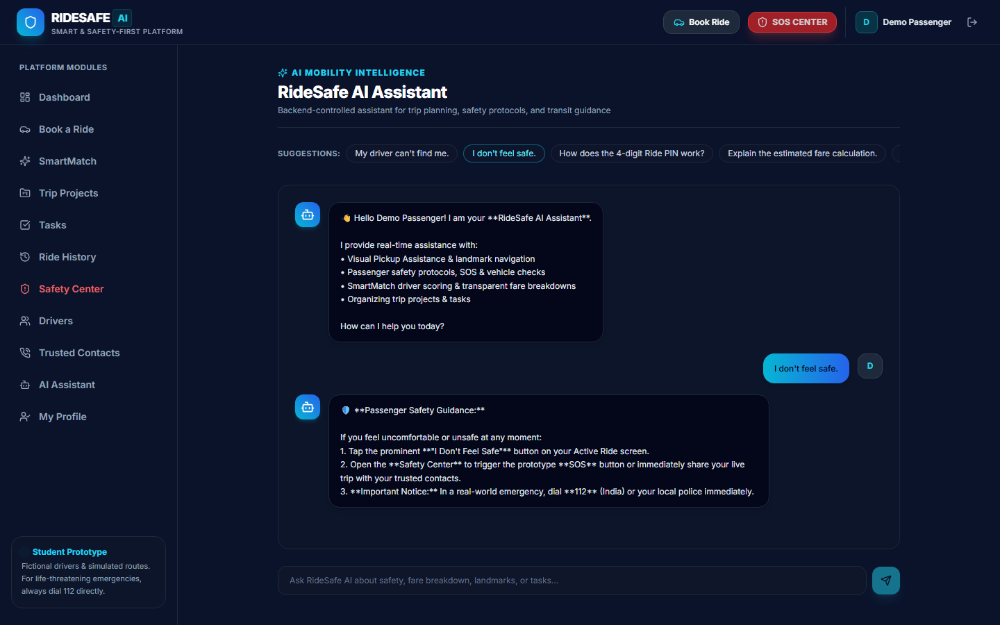
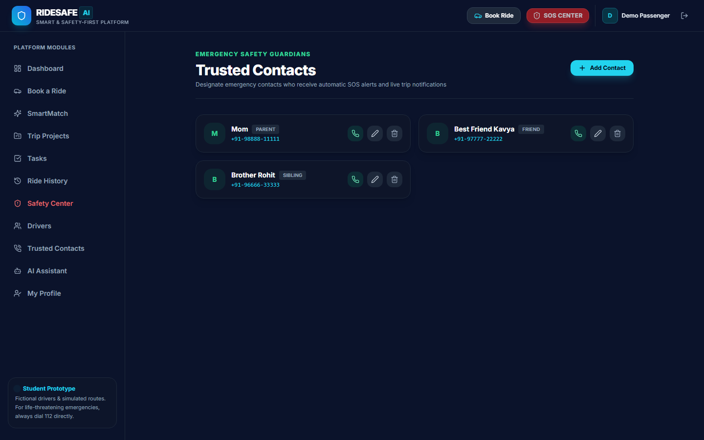
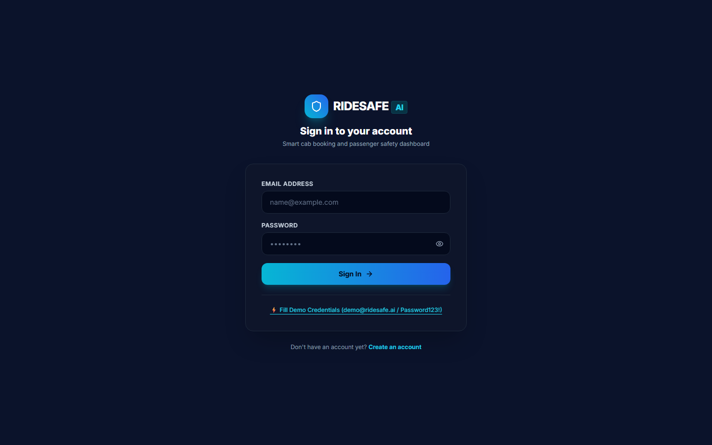
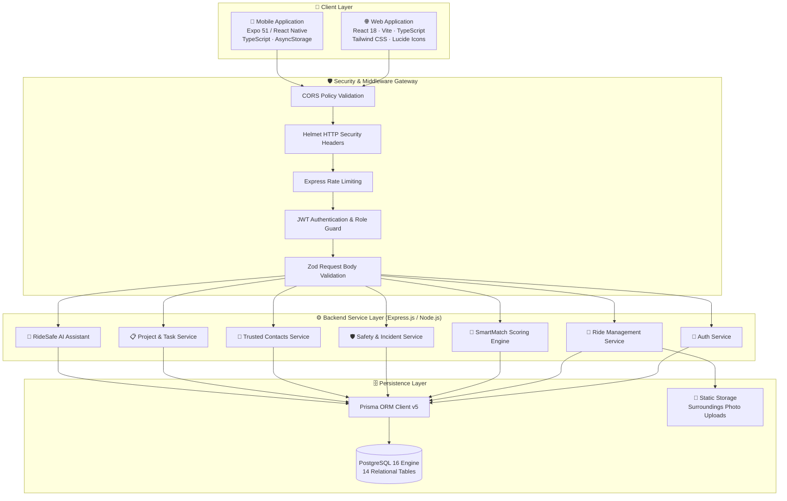

# 🚖 RideSafe AI — Smart & Safety-First Cab Booking + Project Management Platform

<p align="center">
  
  
  
  
  
  
  
  
</p>

---

## 🌟 Overview

**RideSafe AI** is an enterprise-grade, full-stack transportation platform engineered from the ground up with **uncompromising passenger safety**, **algorithmic driver dispatching**, **visual pickup guidance**, and **collaborative travel project management**.

Unlike conventional cab aggregators, RideSafe AI integrates a cryptographic verification protocol, real-time route deviation guards, pre-boarding vehicle checklist audits, and emergency response workflows directly into both modern Web and native Android mobile clients.

---

## 📸 Visual Showcase & Screen Gallery

| 🌐 Landing Page | 📊 Passenger Dashboard |
| :---: | :---: |
|  |  |

| 🚕 Smart Cab Booking & SmartMatch | 🛡️ Safety Center & Emergency Hub |
| :---: | :---: |
|  |  |

| 🚗 Driver Fleet Registry | 📋 Transportation Projects |
| :---: | :---: |
|  |  |

| ✅ Travel Checklists & Task Tracker | 🤖 RideSafe AI Travel Assistant |
| :---: | :---: |
|  |  |

| 👥 Trusted Emergency Contacts | 🔐 Secure Authentication |
| :---: | :---: |
|  |  |

---

## 🛡️ Core Capabilities & Working Features

### 1. 🚕 Algorithmic Cab Booking & SmartMatch Engine
- **Multi-Factor Driver Scoring**: Analyzes candidate drivers across Proximity (30%), Estimated Arrival Time (25%), Historical Rating (20%), Live Availability (15%), and Vehicle Class Match (10%).
- **Multi-Vehicle Classes**: Supports `MINI` (Affordable), `SEDAN` (Comfort & Business), and `SUV` (Spacious Group Travel).
- **Transparent Dynamic Fares**: Real-time fare calculation factoring in Base Fare, Distance (₹15/km), Travel Duration (₹2.50/min), and vehicle tier multipliers.

### 2. 🔒 Multi-Layered Passenger Safety Guard
- **Cryptographic 4-Digit Ride PIN**: Generated on ride request. The trip cannot be initiated in the database until the driver validates this PIN with the passenger.
- **Physical Vehicle Checklist**: Guides passengers through plate number, car make/model, color, and driver portrait verification before stepping in.
- **Simulated Route Deviation Detection**: Continuous GPS corridor monitoring flags route deviations exceeding 150 meters, triggering proactive safety alerts.
- **One-Tap Emergency SOS**: Immediate trigger creating a `CRITICAL` severity incident in PostgreSQL and alerting all pre-configured trusted contacts.
- **Emergency Directory Integration**: Quick-dial links to National Emergency Services (112), Women's Helpline (1091), and Ambulance (108).
- **Live Trip Sharing**: Generates secure, tokenized public URLs for family and friends to monitor trip progress in real time without needing an account.

### 3. 📍 Visual Pickup Assistance
- **Landmark Guidance**: Passengers specify exact visual pickup points (e.g., *"Beside the campus clocktower"*).
- **Surroundings Photo Upload**: Allows uploading images of the passenger's exact surroundings so drivers can locate them in crowded zones.

### 4. 📋 Transportation Project & Task Management
- **Trip Projects**: Group complex travel itineraries (e.g., *"Airport Departures"*, *"Campus Weekend Commute"*).
- **Collaborative Tasks**: Priority-sorted checklists (High/Medium/Low) synchronized between Web and Mobile clients.

### 5. 🤖 Contextual AI Travel Assistant
- **Knowledge Base**: Responds to safety inquiries, PIN verification guidance, emergency workflows, and trip planning with built-in intelligent rules, with external LLM fallback support.

---

## 🏗️ System Architecture



---

## 🗄️ Database Architecture (PostgreSQL & Prisma)

The database schema includes **14 relational models** connected via foreign keys with cascading integrity:

- `users` — Passengers, drivers, and administrative operators
- `drivers` — Driver fleet registry with ratings and live status
- `vehicles` — 1-to-1 attached vehicles with plate numbers and vehicle categories
- `rides` — Ride lifecycle tracking, PINs, telemetry, and itemized fares
- `safety_events` — Security audit logs for SOS broadcasts and mismatches
- `trusted_contacts` — Emergency contact networks for passengers
- `trip_shares` — Tokenized public tracking links
- `route_deviation_events` — GPS corridor deviation telemetry
- `pickup_photos` — Surroundings visual assistance images
- `projects` — Trip itinerary projects
- `tasks` — Travel checklists and task management
- `chat_sessions` & `chat_messages` — AI conversation history
- `ride_ratings` — Driver star reviews and comments

👉 **Full Schema Details**: See [docs/DATABASE_SCHEMA.md](docs/DATABASE_SCHEMA.md)

---

## 🧠 SmartMatch Scoring Breakdown

| Dimension | Weight | Mathematical Basis | Description |
| :--- | :--- | :--- | :--- |
| **Proximity** | **30%** | $\max(0, 1 - \frac{d}{d_{\max}})$ | Distance between driver coordinates and pickup point |
| **ETA** | **25%** | $\max(0, 1 - \frac{\text{ETA}}{30})$ | Estimated driver arrival time in minutes |
| **Rating** | **20%** | $\frac{\text{Rating}}{5.0}$ | Historical passenger satisfaction score |
| **Availability**| **15%** | $1.0 \text{ if AVAILABLE else } 0$ | Immediate readiness to accept dispatch |
| **Vehicle Match**| **10%** | $1.0 \text{ if Type Match else } 0$ | Exact match with requested tier (`MINI`, `SEDAN`, `SUV`) |

👉 **Full Algorithm Specification**: See [docs/SMARTMATCH_ALGORITHM.md](docs/SMARTMATCH_ALGORITHM.md)

---

## 🔑 Demo Credentials

A pre-configured seeded database is ready for immediate demonstration:

- **Email**: `demo@ridesafe.ai`
- **Password**: `Demo@1234`
- **Pre-Seeded Fleet**: 8 verified drivers with vehicles (Rajesh Kumar, Priya Sharma, Mohammed Farooq, Suresh Reddy, etc.)
- **Pre-Seeded Projects**: 2 active transportation projects with 6 tasks.

---

## 🚀 Quick Start Guide

### Prerequisites
- **Node.js**: v20+ or v22+
- **PostgreSQL**: Running on `localhost:5432` with database `ridesafe_ai`

### 1. Backend Server Setup
```bash
cd backend
npm install
npx prisma generate
npx prisma db push
npm run seed       # Seeds demo user, 8 drivers, vehicles, projects, tasks
npm run dev        # Starts REST API on http://localhost:5000
```

### 2. Web Application Setup
```bash
cd web
npm install
npm run dev        # Starts Vite dev server on http://localhost:5173
```
Visit **[http://localhost:5173](http://localhost:5173)** in your browser.

### 3. Mobile Application Setup (Android / Expo)
```bash
cd mobile
npm install --legacy-peer-deps
npm start          # Starts Expo Metro bundler
```
*Note: In the mobile app login screen, you can toggle between `http://10.0.2.2:5000/api` (Android Emulator) or enter your local IP address for physical devices.*

---

## 🧪 Automated Testing & Verification

Run the end-to-end integration test suite verifying all 9 core backend services:

```bash
cd backend
node scripts/test-e2e.js
```

### Verified Test Results:
```text
Testing RideSafe AI Backend Endpoints...
✅ 1. Login SUCCESS. User: Demo Passenger Token received.
✅ 2. Book ride SUCCESS. ID: 9b973657-1c04-468b-9117-91200c22998f PIN: 4243 Fare: ₹721 Driver: Rajesh Kumar
✅ 3. PIN Verification SUCCESS: Ride PIN verified successfully. Ride started. Status: STARTED
✅ 4. Start ride SUCCESS. Status: STARTED
✅ 5. Route deviation check SUCCESS. Deviation: 250 m
✅ 6. Emergency SOS trigger SUCCESS: Emergency SOS protocol initiated
✅ 7. AI Assistant SUCCESS. Reply: 🔢 Ride PIN Verification...
✅ 8. Dashboard stats SUCCESS.
✅ 9. Complete ride SUCCESS. Status: COMPLETED

🎉 ALL 9 BACKEND END-TO-END TESTS PASSED PERFECTLY!
```

---

- [System Architecture Deep-Dive](docs/ARCHITECTURE.md)
- [REST API Reference & Endpoints Guide](docs/API.md)
- [REST API Specification](docs/API_DOCUMENTATION.md)
- [Database Schema & ER Reference](docs/DATABASE_SCHEMA.md)
- [Passenger Safety Architecture & Protocols](docs/SAFETY_SYSTEM.md)
- [SmartMatch & Fare Engine Specification](docs/SMARTMATCH_ALGORITHM.md)
- [Android Mobile App Guide (Expo & React Native)](docs/MOBILE_APP_GUIDE.md)
- [Vercel Production Deployment Guide](docs/DEPLOYMENT.md)
- [Automated Testing & Verification Report](docs/TESTING_REPORT.md)

---

## 🚀 Vercel Deployment

RideSafe AI is architected for native deployment on **Vercel** using **Vercel Services** multi-service orchestration:

```
              ┌──────────────────────────────────────┐
              │                VERCEL                │
              │                                      │
Browser ─────►│ 🌐 Web Service (Vite / React)        │
              │    │                                 │
              │    │ /api/* (Rewritten)              │
              │    ▼                                 │
              │ 🔧 Backend Service (Express)         │
              └──────────────┬───────────────────────┘
                             │
                             ▼
                     🐘 PostgreSQL (Remote)

Android Mobile ──────────────► /api/* (Remote Backend)
```

### 1. Multi-Service Configuration (`vercel.json`)
The root `vercel.json` coordinates both services:
- **Service `backend`**: Express REST API located in `/backend` serving `/api/*`.
- **Service `web`**: Vite/React SPA located in `/web` serving all other paths `/*`.
- **Android App**: Standalone mobile client (NOT a Vercel service) connecting to `https://YOUR-VERCEL-DOMAIN/api`.

### 2. Required Vercel Environment Variables

#### For Backend Service:
- `DATABASE_URL` — Connection string to cloud PostgreSQL (e.g., Neon, Supabase) with SSL mode enabled.
- `JWT_SECRET` — 64-character secret for signing JWT tokens.
- `JWT_EXPIRES_IN` — Token lifespan (e.g. `7d`).
- `CORS_ORIGIN` — Production domain(s), e.g. `https://your-domain.vercel.app`.
- `AI_API_KEY` — *(Optional)* External OpenAI API key for RideSafe AI Assistant.

#### For Web Service:
- `VITE_API_URL` — Set to `/api` (automatically routes calls on the shared domain).

👉 **Complete Step-by-Step Deployment Instructions**: See [docs/DEPLOYMENT.md](docs/DEPLOYMENT.md)


---

## 📂 Repository Structure

```
RIDESAFE-AI/
├── backend/                    # Express REST API (Node.js / TypeScript)
│   ├── prisma/                 # Prisma schema & seed script
│   ├── src/
│   │   ├── controllers/        # Route controllers (Auth, Ride, Safety, AI, etc.)
│   │   ├── middleware/         # Auth, validation, rate-limiting, error handling
│   │   ├── routes/             # Express API route definitions
│   │   ├── services/           # Business logic & SmartMatch engine
│   │   └── validators/         # Zod request validation schemas
│   └── scripts/                # End-to-end verification scripts
├── web/                        # React 18 Web Client (Vite / TypeScript / Tailwind)
│   ├── src/
│   │   ├── components/         # Reusable UI components & layouts
│   │   ├── context/            # AuthContext, RideContext
│   │   ├── pages/              # 11 full-fidelity page views
│   │   └── services/           # Axios HTTP client
├── mobile/                     # Android Mobile Client (Expo / React Native)
│   └── src/
│       ├── navigation/         # Tab & stack navigators
│       ├── screens/            # 10 native screens
│       └── services/           # AsyncStorage API client
├── docs/                       # Technical documentation & design specs
│   ├── diagrams/               # Mermaid architecture & data flow diagrams
│   └── screenshots/            # 11 high-resolution UI screenshots
├── scripts/                    # Playwright screenshot automation
└── README.md                   # Project overview & documentation
```

---

## 📄 License

This project is licensed under the **MIT License**.
