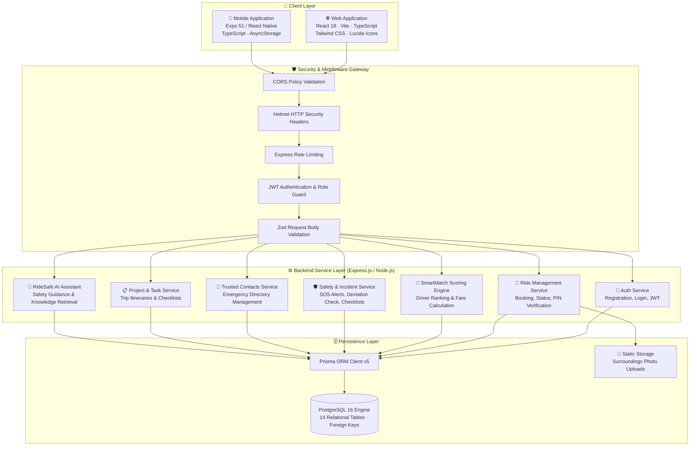

# RideSafe AI — System Architecture & Design

## 1. Executive Summary

**RideSafe AI** is an enterprise-grade full-stack platform that unifies intelligent ride-hailing with a strict safety-first verification layer and a collaborative transportation project & task management suite. The platform is architected around a decoupled client-server model communicating over secure REST APIs with token-based authentication.

---

## 2. High-Level Architecture Overview



---

## 3. Technology Stack Breakdown

| Layer | Technologies | Justification & Role |
| :--- | :--- | :--- |
| **Frontend Web** | React 18, Vite, TypeScript, Tailwind CSS, Lucide Icons, Axios | Lightning-fast build times, strict static typing, responsive mobile-first UI, unified design system. |
| **Frontend Mobile**| React Native, Expo 51, TypeScript, AsyncStorage | Cross-platform Android deployment, native performance, persistent session management. |
| **Backend REST API**| Node.js 22, Express.js, TypeScript | Non-blocking asynchronous I/O, scalable route architecture, robust middleware pipeline. |
| **ORM / Data Access**| Prisma ORM v5 | Type-safe queries, automated schema migrations, zero SQL-injection vulnerability. |
| **Database** | PostgreSQL 16 | Relational consistency, ACID transactions, geospatial data capability, foreign key integrity. |
| **Security Suite** | Helmet, bcryptjs, JSON Web Tokens (JWT), express-rate-limit, Zod | Defense-in-depth: password hashing (10 salt rounds), hardened headers, DDoS prevention. |
| **Testing & CI** | Playwright, Node Test Scripts | End-to-end verification, browser UI screenshot automation, regression prevention. |

---

## 4. Client Layer Architecture

### 4.1 Web Client (`/web`)
- **Routing**: `react-router-dom` with route guards for authenticated sessions.
- **State Management**:
  - `AuthContext`: Centralized JWT authentication state, token renewal, and profile persistence.
  - `RideContext`: Live active ride polling, status progression, and PIN state synchronization.
- **Service Layer**: Dedicated Axios abstraction module (`src/services/api.ts`) managing automatic `Authorization: Bearer <token>` injection and centralized HTTP error handling.

### 4.2 Mobile Client (`/mobile`)
- **Navigation**: Tab-based navigation and Stack navigators mirroring the web workflow.
- **Storage**: `@react-native-async-storage/async-storage` for persisting auth tokens and custom backend API endpoint URLs (enabling effortless local Wi-Fi / emulator debugging).

---

## 5. Backend Service Layer & Middleware Pipeline

Every HTTP request passes through a sequential pipeline:

```
Request ➡️ Helmet Headers ➡️ CORS Filter ➡️ JSON Parser ➡️ Rate Limiter 
        ➡️ JWT Authentication ➡️ Zod Schema Validation ➡️ Controller 
        ➡️ Service Layer ➡️ Prisma ORM ➡️ PostgreSQL ➡️ Response
```

1. **Helmet & Security Headers**: Adds CSP, anti-MIME sniffing (`X-Content-Type-Options: nosniff`), and frame denial (`X-Frame-Options: SAMEORIGIN`).
2. **CORS Validation**: Restricts cross-origin interactions strictly to authorized web origins.
3. **Authentication Middleware (`src/middleware/auth.ts`)**: Decodes and verifies the Bearer JWT token against the cryptographically secure server secret.
4. **Zod Validation Middleware**: Validates inbound JSON payloads strictly against defined TypeScript schema shapes before business logic executes.
5. **Global Error Middleware (`src/middleware/errorHandler.ts`)**: Catches all unhandled rejections, converts database constraints into human-readable errors, and prevents stack trace leakage in production.

---

## 6. Data Integrity & Concurrency

- **Unique Constraints**: Unique indexes on `User.email`, `Driver.licenseNumber`, `Vehicle.plateNumber`, `Ride.shareCode`.
- **Foreign Key Cascades**: Explicitly defined relational cascades guarantee referential integrity across Rides, Incidents, Tasks, and Contacts.
- **Ride Status Enforcement**: Strict enum state machine prevents impossible transitions (e.g., cannot complete a ride that has not been started).
