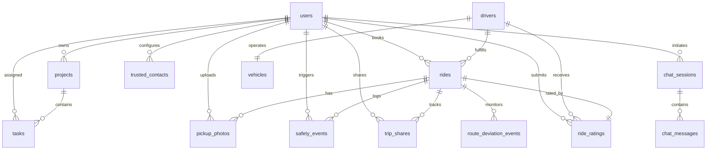

# RideSafe AI — Database Schema Documentation

RideSafe AI leverages **PostgreSQL 16** managed via **Prisma ORM v5**. The schema contains **14 relational models**, **8 enums**, and cascading foreign-key references ensuring strict data integrity.

---

## 1. Entity Relationship (ER) Summary

---

## 2. Enumerations

| Enum Name | Permitted Values | Description |
| :--- | :--- | :--- |
| `Role` | `PASSENGER`, `DRIVER`, `ADMIN` | User access control permissions. |
| `VehicleType` | `MINI`, `SEDAN`, `SUV` | Vehicle categorization and pricing tier. |
| `RideStatus` | `REQUESTED`, `DRIVER_ASSIGNED`, `DRIVER_ARRIVING`, `DRIVER_ARRIVED`, `STARTED`, `COMPLETED`, `CANCELLED` | Complete ride lifecycle state machine. |
| `DriverStatus` | `AVAILABLE`, `ON_RIDE`, `OFFLINE` | Live availability of drivers. |
| `ProjectStatus`| `NOT_STARTED`, `IN_PROGRESS`, `COMPLETED` | Transportation itinerary status. |
| `TaskPriority` | `LOW`, `MEDIUM`, `HIGH` | Checklist priority level. |
| `TaskStatus` | `PENDING`, `IN_PROGRESS`, `COMPLETED` | Checklist execution status. |
| `ContactRelationship` | `PARENT`, `FRIEND`, `SIBLING`, `OTHER` | Classification of emergency contacts. |
| `SafetyEventType` | `SOS`, `VEHICLE_MISMATCH`, `ROUTE_DEVIATION`, `USER_UNSAFE`, `REPORT_ISSUE` | Security event taxonomy. |
| `MessageRole` | `USER`, `ASSISTANT`, `SYSTEM` | Chat conversational actor. |

---

## 3. Relational Table Definitions

### 3.1 `users`
Core identity table representing passengers, drivers, and administrative operators.
- `id` (UUID PK): Unique identifier.
- `name` (VARCHAR): Full name.
- `email` (VARCHAR UNIQUE): Login email.
- `passwordHash` (VARCHAR): 10-round bcrypt hash.
- `phoneNumber` (VARCHAR NULLABLE): Contact number for SMS / SOS alerts.
- `role` (Role): Defaults to `PASSENGER`.

### 3.2 `drivers`
Professional driver fleet profiles.
- `id` (UUID PK): Driver identifier.
- `name` (VARCHAR): Full name.
- `photoUrl` (VARCHAR NULLABLE): Verified avatar.
- `rating` (FLOAT): Running aggregate rating (default: 5.0).
- `totalRides` (INT): Total lifetime completed trips.
- `status` (DriverStatus): `AVAILABLE`, `ON_RIDE`, or `OFFLINE`.
- `phoneNumber` (VARCHAR): Driver direct contact.
- `latitude`, `longitude` (FLOAT NULLABLE): Real-time telemetry coordinates.

### 3.3 `vehicles`
Hardware vehicle asset attached to exactly one driver (1-to-1).
- `id` (UUID PK): Vehicle identifier.
- `driverId` (UUID FK UNIQUE): References `drivers(id)` on delete cascade.
- `model` (VARCHAR): e.g. "Honda City (White)", "Hyundai i20 (Silver)".
- `vehicleNumber` (VARCHAR UNIQUE): Government license plate (e.g. `TN 09 BK 4021`).
- `color` (VARCHAR): Body paint color for visual passenger confirmation.
- `type` (VehicleType): Tier classification (`MINI`, `SEDAN`, `SUV`).

### 3.4 `rides`
The central ride transaction entity tracking lifecycle, verification, and fares.
- `id` (UUID PK): Unique ride tracking token.
- `userId` (UUID FK): Passenger (`users(id)`).
- `driverId` (UUID FK NULLABLE): Assigned driver (`drivers(id)`).
- `pickup`, `destination` (VARCHAR): Text addresses.
- `landmark` (VARCHAR NULLABLE): Passenger visual pickup point.
- `rideType` (VehicleType): Vehicle tier booked.
- `status` (RideStatus): Current lifecycle state.
- `pin` (VARCHAR): **Cryptographic 4-digit PIN** required to start trip.
- `fareEstimate`, `baseFare`, `distanceFare`, `timeFare` (FLOAT): Detailed fare breakdown.
- `distanceKm`, `durationMin` (FLOAT): Trip telemetry.
- `vehicleMatches` (BOOLEAN NULLABLE): Pre-boarding checklist verification flag.
- `startedAt`, `completedAt`, `cancelledAt` (DATETIME NULLABLE): Event timestamps.

### 3.5 `safety_events`
Security audit trail recording all emergency and incident actions.
- `id` (UUID PK): Event record token.
- `rideId` (UUID FK NULLABLE): Associated ride.
- `userId` (UUID FK): Passenger reporting or triggering.
- `type` (SafetyEventType): Incident classification.
- `severity` (VARCHAR): "HIGH", "CRITICAL", etc.
- `details` (TEXT NULLABLE): JSON or human notes.
- `status` (VARCHAR): "ACTIVE", "RESOLVED".

### 3.6 `trusted_contacts`
Emergency contact network for instant SOS broadcasts.
- `id` (UUID PK): Contact token.
- `userId` (UUID FK): Passenger owner.
- `name` (VARCHAR): Contact full name.
- `phoneNumber` (VARCHAR): Validated mobile number.
- `relationship` (ContactRelationship): `PARENT`, `FRIEND`, etc.

### 3.7 `route_deviation_events`
GPS anomaly detection events.
- `id` (UUID PK)
- `rideId` (UUID FK): Associated ride.
- `expectedRoute`, `simulatedRoute` (TEXT): Encoded geometries.
- `deviationMeters` (FLOAT): Calculated corridor delta (e.g., 250m).
- `status` (VARCHAR): "REPORTED", "DISMISSED".

### 3.8 `projects` & `tasks`
Transportation itinerary planning and logistics checklists.
- `projects`: `id`, `userId`, `name`, `description`, `status`, `startDate`, `endDate`.
- `tasks`: `id`, `projectId`, `userId`, `name`, `priority`, `status`, `dueDate`.

### 3.9 `pickup_photos`
Surroundings visual assistance images uploaded by passengers.
- `id`, `rideId`, `userId`, `imageUrl`, `description`.

### 3.10 `chat_sessions` & `chat_messages`
Contextual AI dialogue persistence with role history (`USER`, `ASSISTANT`, `SYSTEM`).

### 3.11 `ride_ratings`
Post-trip review with 1-5 star score and feedback notes.
