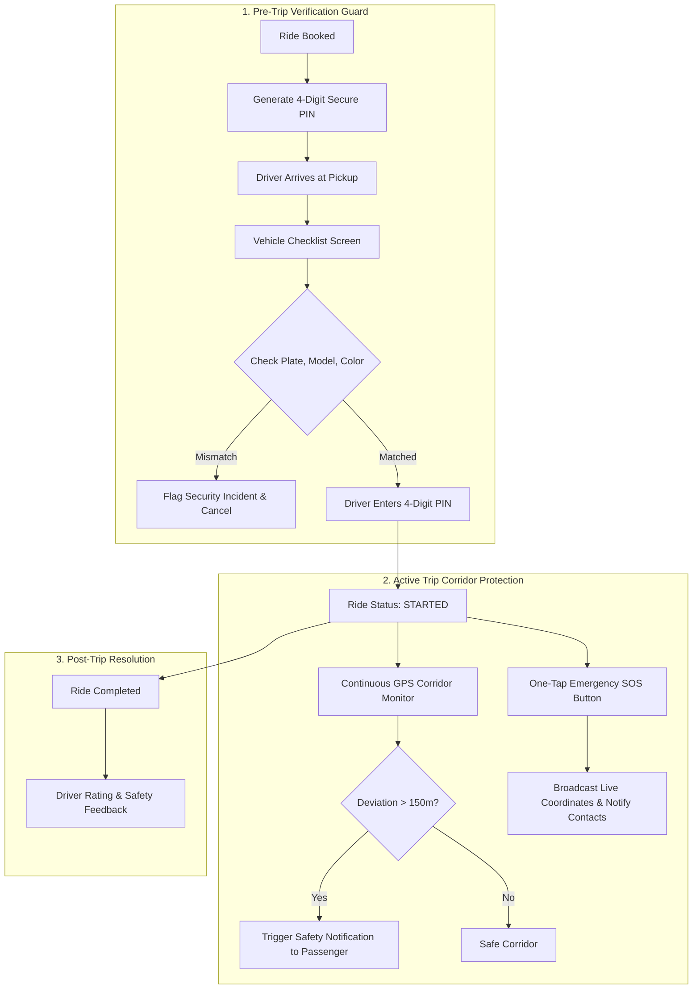

# RideSafe AI — Passenger Safety Architecture & Protocols

RideSafe AI is built with an uncompromising commitment to **zero-compromise passenger safety**. The system enforces a multi-layered verification barrier before, during, and after every ride.

---

## 1. Safety Architecture Lifecycle

---

## 2. Core Safety Pillars

### 2.1 Cryptographic 4-Digit Ride PIN
- **Generation**: Created automatically via cryptographically random 4-digit generation when a ride is requested.
- **Enforcement**: Stored in the backend database and presented prominently on the passenger's mobile/web interface.
- **Validation**: Drivers **cannot start the trip** without entering this exact PIN. This guarantees mutual verification and eliminates the risk of boarding the wrong cab or unauthorized driver pickups.

### 2.2 Vehicle Checklist & Physical Verification
Before entering the vehicle, the passenger is guided through a four-point physical verification audit:
1. **License Plate Match**: Checking against the official government registration number (e.g. `TN 09 BK 4021`).
2. **Vehicle Model & Make**: Confirming vehicle model (e.g. `Honda City`).
3. **Vehicle Color**: Visual confirmation (e.g. `Pearl White`).
4. **Driver Profile Photo**: Matching driver face against verified profile avatar.

If any check fails, the passenger can instantly flag a mismatch (`POST /api/rides/:id/unsafe`), which aborts the ride and logs an urgent safety event with severity `HIGH`.

### 2.3 Simulated Route Deviation Monitor
- Active rides are continuously monitored against their expected route corridor.
- If GPS coordinates deviate by more than **150 meters** from the expected route trajectory:
  - An automated `RouteDeviationEvent` is generated.
  - A prominent yellow alert modal prompts the passenger to confirm their safety.
  - If unconfirmed within a grace period, escalation protocols are activated.

### 2.4 One-Tap Emergency SOS
- Available at all times via a floating high-visibility Red Shield icon.
- Tapping SOS instantly:
  1. Triggers `POST /api/rides/:id/sos`.
  2. Creates a critical `SafetyEvent` in PostgreSQL with severity `CRITICAL`.
  3. Dispatches automated alerts to all linked **Trusted Contacts**.
  4. Surfaces instant one-touch emergency dials:
     - **112**: National Emergency Services (Police/Ambulance).
     - **1091**: Women's Safety Helpline.
     - **108**: Medical Emergency Ambulance.

### 2.5 Live Trip Sharing (`TripShare`)
- Passengers can generate a secure, temporary tracking token (`POST /api/rides/:id/share`).
- Family members receive a URL (e.g., `http://localhost:5173/track/RS-8921-X`) where they can view real-time trip status, driver details, and current coordinates without needing an account.
